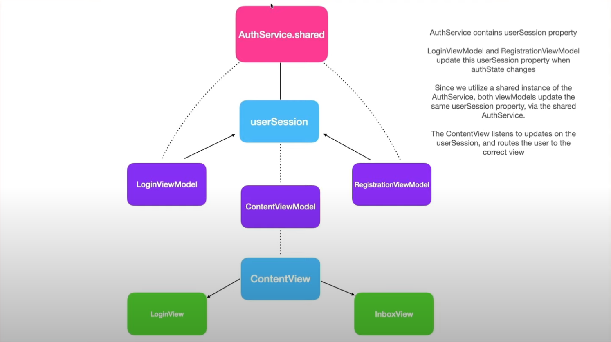

### Why do we use singleton of userSession?
Since multiple components are utilizing AuthService, it's important to make sure they utilize shared instance.
It has userSession property as shown in the image. 

LoginViewModel and RegistrationViewModel are both updating the same userSession property through shared instance. 

ContentViewModel is listening for updates on the userSession property that are being updated by LoginViewModel and RegistrationViewModel.
